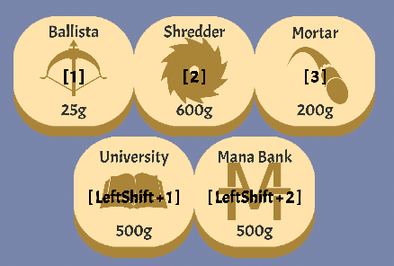
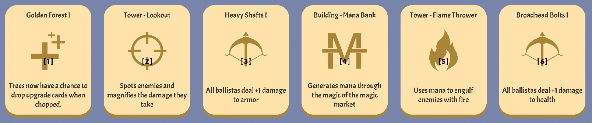
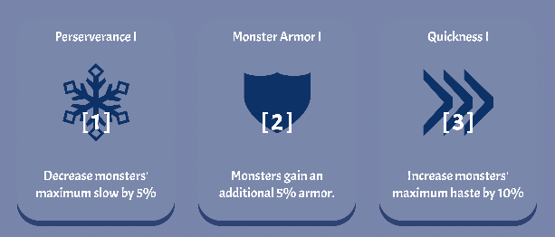
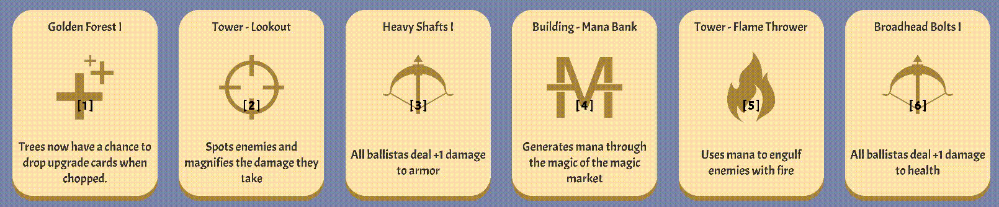

<h1 align="center">
  
  

  
  
  
</h1>

> RogueTower BepInEx Plugin for selecting towers, cards, and even banishing via configurable keybinds.

---

 

## [Overview](#overview)

In RogueTower, you manually have to click towers and upgrade cards to select them. In the case of cards, it even
requires two clicks in different spots. When placing several towers back-to-back, or when speedrunning games, this can
become excessive.

This mod provides configurable keybinds that you can use to quickly select towers, upgrade cards, monster cards, and
even banishing cards.

## [Installation](#installation)

There are two ways to install this mod; manually, or with a mod loader.

### [Manual Installation](#manual-installation)

Make sure you have [BepInEx](https://docs.bepinex.dev/articles/user_guide/installation/index.html) installed, and have
run the game at least once.

Download the [latest released version](https://github.com/daymxn/RogueTower-SlotKeybinds/releases) of the mod on GitHub.

Extract the `daymxn.RogueTower.SlotKeybinds.dll` file to the `BepInEx/plugins` directory in your game files. If you
don't have a `plugins` directory, you can go ahead and create one.

### [Thunderstore](#thunderstore)

This mod is published to the [Thunderstore](https://thunderstore.io/) repo, where you can use their [in-house mod manager](https://www.overwolf.com/app/thunderstore-thunderstore_mod_manager)
or the [r2modman](https://thunderstore.io/c/rogue-tower/p/ebkr/r2modman/) mod manager to automate the installation.

You can find this mod under [daymxn/SlotKeybinds](https://thunderstore.io/c/rogue-tower/p/daymxn/SlotKeybinds/).

## [Configuration](#configuration)

After running the game for the first time with the mod installed, a configuration file will be automatically generated
in the `BepInEx/config` folder called `daymxn.RogueTower.SlotKeybinds.cfg`. You can configure any of the config options
mentioned in the [features](#features) section here.

If you're using a mod loader, they typically have a section dedicated to editing config files.

## [Features](#features)

### [Slot Keybinds](#slot-keybinds)

There are 10 different `Slot` config options, each corresponding to a specific slot.

By default, these are set to the top row of numbers on your keyboard.

These keybinds are used for all the other features.

### [Select Towers](#select-towers)

By enabling the `TowerSelect` config option, you can use the [slot keybinds](#slot-keybinds) to enter build mode for
the tower in the specified slot.

> [!NOTE]
> The overlay text can be toggled for both towers _and_ buildings via the `Towers` config option under the `Overlay`
> section. 

### [Select Buildings](#select-buildings)

Since buildings are put into a separate row from towers, we use a combo key to access them.

By enabling the `BuildingSelect` config option, you can set up a combo key via the `BuildingKey` config option. While
this combo key is held, pressing any of the [slot keybinds](#slot-keybinds) will enter build mode for the building in
that slot instead of the tower.

This combo key is shown in the overlay gui as well (see the example photo in the [select towers](#select-towers) 
section).

### [Select Upgrade Cards](#select-upgrade-cards)

By enabling the `UpgradeCardSelect` config option, you can use the [slot keybinds](#slot-keybinds) to automatically
select an upgrade card when presented.

> [!NOTE]
> The overlay text can be toggled via the `UpgradeCards` config option under the `Overlay` section.

### [Select Monster Cards](#select-monster-cards)

By enabling the `MonsterCardSelect` config option, you can use the [slot keybinds](#slot-keybinds) to automatically
select a monster card when presented.

> [!NOTE]
> The overlay text can be toggled via the `MonsterCards` config option under the `Overlay` section.

### [Banish Upgrade Cards](#banish-upgrade-cards)

If you have the [BanishCards](https://github.com/agustinbutrico/BanishCards/tree/main) mod installed, you can set up
keybinds to automatically banish upgrade cards when presented.

The feature can be enabled via the `Enabled` config option under the `Banish` section. 

When enabled, holding the configured key (`Key` config option under the `Banish` section) and using a [slot keybinds](#slot-keybinds)
will banish the card instead of selecting it.

To help signal that you're about to banish a card, the color of the card's image will fade to red while the banish key
is held.

You can toggle this behavior via the `CardColors` config option under the `Banish` section. You can also set the color
it fades to via the `Color` option.

## [License](#license)

[Apache 2.0](./LICENSE)
